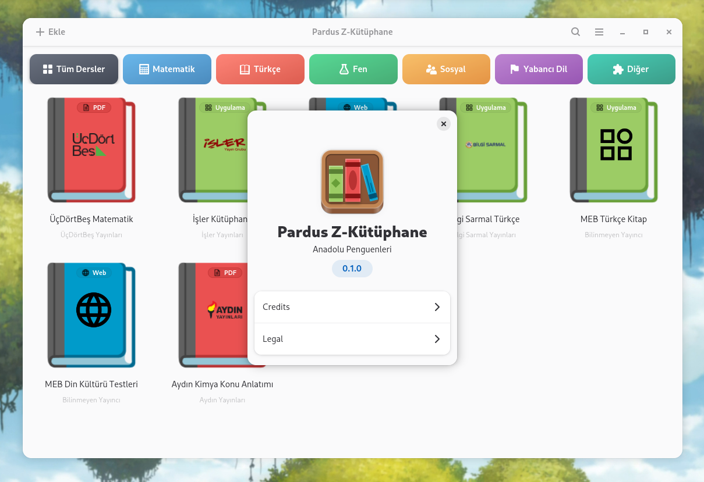
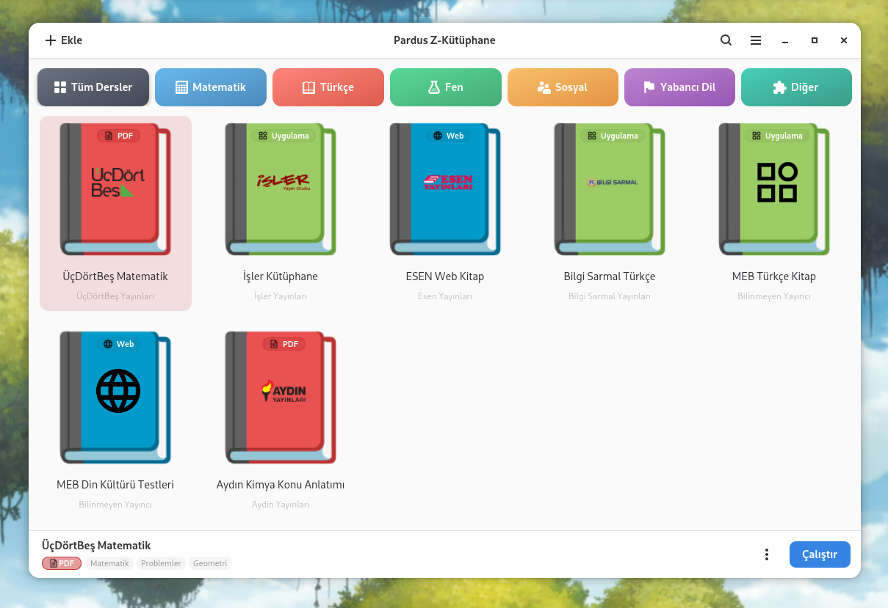
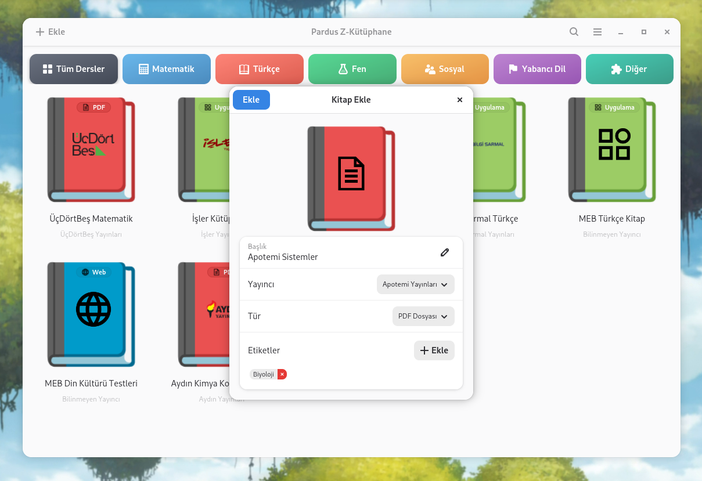
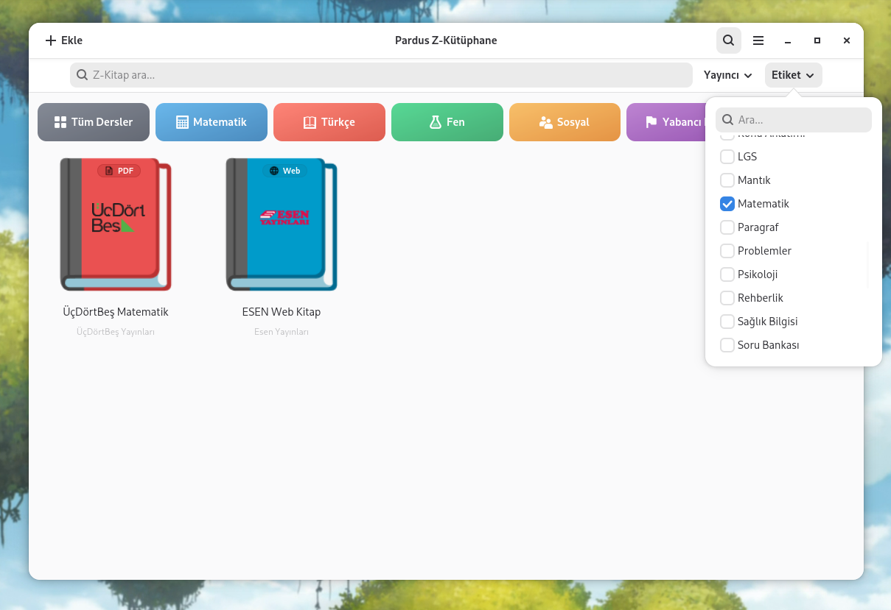

Pardus Z-Kütüphane, Pardus için özel olarak geliştirilmiş, kullanıcı dostu bir **Z-Kitap çalıştırma ve organizasyon aracıdır**. 

Pardus Z-Kütüphane; çalıştırılabilir uygulama (Windows `.exe` veya Linux `.AppImage`), web sitesi ve PDF dosyası formatlarındaki Z-Kitaplar tek bir arayüz üzerinden yönetmeyi ve çalıştırmayı sağlar. Pardus'un akıllı tahtalarda kullanılan sürümü olan **ETAP** ile birlikte **akıllı tahtalarda, öğretmenler tarafından** ders, konu anlatım ve test kitapları ile kullanılması hedeflenmektedir. Bu hedefe yönelik uygulama, kullanıcı ve akıllı tahta dostu olacak şekilde tasarlanmıştır. Diğer Pardus uygulamaları gibi, Python ve GTK teknolojileri kullanılarak geliştirilmiştir.

Pardus Z-Kütüphane, Gazi Üniversitesi'nden **Anadolu Penguenleri** takımı tarafından, **TEKNOFEST Pardus Hata Yakalama ve Geliştirme Yarışması** için geliştirilmiştir.

## Kurulum

Pardus Z-Kütüphane'yi, GitHub depomuzun Releases kısmındaki `.deb` paketini inidirip, Pardus Paket Kurucu ile Pardus sisteminize kurabilirsiniz. 

## Kullanım

### Kütüphane Görünümü

Uygulamaya eklenen Z-Kitaplar, ızgara şeklindeki kütüphane görünümüne eklenir. Her Z-Kitap; kapağı, ismi ve yayıncısı ile bir kart olarak gösterilir. Kartların üzerindeki simge ve renkler, kitabın türünü (uygulama, PDF veya web) belirtir. Kütüphane boşken, ekranda kitap eklemeye yönlendiren bir karşılama mesajı gösterilir. Kitaplar, varsayılan olarak en çok kullanılan en üstte olacak şekilde sıralanır.

Bir karta tıklanıp seçildiğinde, pencerenin altında o kitaba ait detayların (isim, tür ve etiketler), **Çalıştır** butonunun ve diğer eylemleri içeren bir menünün bulunduğu bir eylem çubuğu belirir.

### Kitap Ekleme

Pencerenin sol üst köşesinde bulunan **Ekle** butonu kullanılarak kütüphaneye Z-Kitap eklenebilir. Ekle butonuna tıklandığında **Dosya ekle** ve **Bağlantı ekle** olmak üzere iki seçenek çıkar:

- **Dosya ekleme**: Çalıştırılabilir uygulama (Windows `.exe` veya Linux `.AppImage`/`.fernus`) veya PDF (`.pdf`) dosyaları ***Dosya ekle** seçeneği seçildikten sonra çıkan dosya seçicididen seçilerek eklenebilir. Ayrıca istenilen dosyalar dosya yöneticisi üzerinden Pardus Z-Kütüphane penceresine **sürükle bırak** yapılarak da eklenebilir.
-  **Bağlantı ekleme**: Web kitapları, tarayıcıdan link olarak kopyalanıp **Bağlantı ekle** seçeneği seçildikten sonra açılan penceredeki girdiye yapıştırılarak eklenebilir.

Seçilen yöntem ile ekleme yapıldıktan sonra, **Kitap Ekle** penceresi açılır. Bu pencerede eklenecek kitabın detayları gösterilir. Aynı zamanda kitabın ismini değiştirme, yayıncı seçimi veya etiket ekleme çıkarma da bu pencereden gerçekleştirilebilir. Pardus Z-Kütüphane, dosya ismi ve metadata bilgisinden yayıncı ve etiket çıkarımını otomatik olarak yapma özelliğine sahiptir.

Kitap özellikleri, kitap eklendikten sonra Çalıştır butonunun yanındaki menü içerisindeki **Düzenle** seçeneği seçilerek de düzenlenebilir.

### Kitap Açma/Çalıştırma

Kütüphaneden bir Z-Kitap seçildikten sonra, pencerenin altında beliren eylem çubuğundaki **Çalıştır** butonuna tıklanarak kitap açılır. Kitabın türüne göre açılma şekli farklılık gösterir:

- **Uygulamalar**: Linux uygulamaları (`.AppImage`/`.fernus`) doğrudan, Windows uygulamaları (`.exe`) ise Wine üzerinden çalıştırılır.
- **PDF dosyaları**: Sistemin varsayılan PDF görüntüleyicisinde açılır.
- **Web kitapları**: Sistemin varsayılan tarayıcısında açılır.

Çalıştırılan bir uygulamanın ürettiği çıktılar, **Çalıştır** butonunun yanındaki menüde bulunan **Günce** seçeneği ile görüntülenebilir. Günce yalnızca uygulama türündeki Z-Kitaplar için kullanılabilir.

### Kitap Arama ve Filtreleme

Sağ üstte bulunan **arama ikonuna** tıklanınca yukarıdan açılan **arama çubuğu** kullanılarak kütüphanedeki Z-Kitaplar isimlerine göre aranabilir. Arama çubuğunda ayrıca **Yayıncı** ve **Etiket** butonları bulunur; bu butonlar ile kitaplar yayıncılarına ve etiketlerine göre filtrelenebilir. Yapılan arama ve filtrelemeler birlikte uygulanır.

Kütüphane görünümünün üst kısmında bulunan **ders filtresi butonları** (Tüm Dersler, Matematik, Türkçe, Fen, Tarih, İngilizce) ile kitaplar, ait oldukları başlıca derslere göre tek tıkla hızlıca görüntülenebilir. **Tüm Dersler** butonu ders filtresini kaldırarak kütüphanedeki tüm kitapları gösterir.

## Geliştirme ve Altyapı

Proje Meson build sistemini kullanmaktadır. Uygulama, kök dizinindeki `./run.sh` scriptini çalıştırarak çalıştırılabilir.

### Proje Dizin Yapısı

Proje kaynak kodu ve dosyaları başlıca şu dizinlerden oluşur:

- `src/`: Uygulama kaynak kodu
  - `main.py`: Uygulama giriş noktası (`Adw.Application`)
  - `window.py`: Ana pencere ve arayüz mantığı
  - `backend/`: Tür tespiti, çalıştırma ve otomatik tespit modülleri
  - `widgets/`: Özel GTK bileşenleri ve pencereler
  - `ui/`: Blueprint (`.blp`) arayüz dosyaları
  - `util/`: Yardımcı modüller (normalizer, logger)
  - `resources/`: Simge, görsel ve stil dosyaları
- `data/`: Masaüstü girdisi, GSettings şeması, uygulama simgeleri ve yayıncı verileri
- `po/`: Çeviri dosyaları
- `debian/`: Debian paketleme dosyaları
- `meson.build`: Meson build tanımı
- `run.sh`: Projeyi derleyip çalıştıran script

### Backend Sistemi

Backend, `src/backend/` dizininde bulunan ve arayüzden bağımsız çalışan mantık modüllerinden oluşur. Bu modüller kitapların türünü tespit etme, çalıştırma ve dosya isminden yayıncı ile etiket çıkarımı gibi işlemlerden sorumludur:

| Modül | Görevi |
|---|---|
| `TypeDetector` | Dosyanın türünü (`.exe`, `.AppImage`, `.pdf` vb.) baytlarını inceleyerek tespit eder |
| `Launcher` | Kitabı türüne göre uygun backend'e yönlendirir |
| `ELFBackend` / `WineBackend` | Linux ve Windows uygulamalarını çalıştırır |
| `PDFBackend` / `WebbookBackend` | PDF dosyalarını ve web kitaplarını açar |
| `PublisherDetector` | Dosya isminden yayıncıyı otomatik tespit eder |
| `TagDetector` | Dosya isminden etiketleri otomatik tespit eder |

### Arayüz Altyapısı

Uygulamanın arayüzü GTK 4 ve libadwaita kullanılarak oluşturulmuştur. Arayüz bileşenleri, `src/ui/` dizinindeki **Blueprint** (`.blp`) dosyalarında tanımlanır; bu dosyalar derleme sırasında `.ui` dosyalarına çevrilip GResource olarak uygulamaya gömülür.

`src/widgets/` dizinindeki Python sınıfları, `Gtk.Template` aracılığıyla bu arayüz tanımlarına bağlanır ve bileşenlerin mantığını sağlar. Kütüphane görünümü (`ZLibCardView`), kitap kartları (`ZLibCard`), kitap ekleme penceresi (`ZLibAddBookDialog`) ve tercihler penceresi (`PreferencesDialog`) bu şekilde tanımlanmıştır. Arayüzün görsel stili `src/style.css` dosyası, kullanıcı tercihleri ise GSettings ile yönetilir.

### Derleme Bağımlılıkları

| Bağımlılık | Açıklama |
|---|---|
| `meson` (>= 1.0.0) | Build sistemi |
| `ninja-build` | Meson tarafından kullanılan derleyici |
| `blueprint-compiler` | `.blp` arayüz dosyalarını derlemek için |
| `libglib2.0-dev-bin` | GSettings şeması derlemek için (`glib-compile-schemas`) |
| `libglib2.0-bin` | GLib çalışma zamanı araçları |
| `desktop-file-utils` | `.desktop` dosyasını doğrulamak için |
| `appstream` | AppStream metainfo dosyasını doğrulamak için |
| `gettext` | Çeviri dosyalarını (`po/`) işlemek için |

### Çalışma Zamanı Bağımlılıkları

| Bağımlılık | Açıklama |
|---|---|
| `python3` | Uygulama çalışma zamanı |
| `python3-gi` | GTK ve Adwaita Python bağlantıları (PyGObject) |
| `gir1.2-gtk-4.0` (>= 4.8) | GTK 4 arayüz kütüphanesi |
| `gir1.2-adw-1` (>= 1.2) | Adwaita stil ve bileşen kütüphanesi |
| `python3-filetype` | Dosya türü tespiti için |
| `wine` | Windows `.exe` dosyalarını çalıştırmak için |
