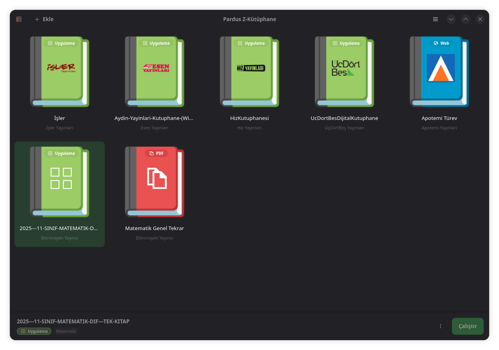

Pardus Z-Kütüphane, Pardus için özel olarak geliştirilmiş, kullanıcı dostu bir **Z-Kitap çalıştırma ve organizasyon aracıdır**. 

Pardus Z-Kütüphane; çalıştırılabilir uygulama (Windows `.exe` veya Linux `AppImage`), web sitesi ve PDF dosyası formatlarındaki Z-Kitaplarr tek bir arayüz üzerinden yönetmeyi ve çalıştırmayı sağlar. Pardus'un akıllı tahtalarda kullanılan sürümü olan **ETAP** ile birlikte **akıllı tahtalarda, öğretmenler tarafından** ders, konu anlatım ve test kitapları ile kullanılması hedeflenmektedir. Bu hedefe yönelik uygulama, kullanıcı ve akıllı tahta dostu olacak şekilde tasarlanmıştır. Diğer Pardus uygulamaları gibi, Python ve GTK teknolojileri kullanılarak geliştirilmiştir.

Pardus Z-Kütüphane, Gazi Üniversitesi'nden **Anadolu Penguenleri** takımı tarafından, **TEKNOFEST Pardus Hata Yakalama ve Geliştirme Yarışması** için geliştirilmiştir.

